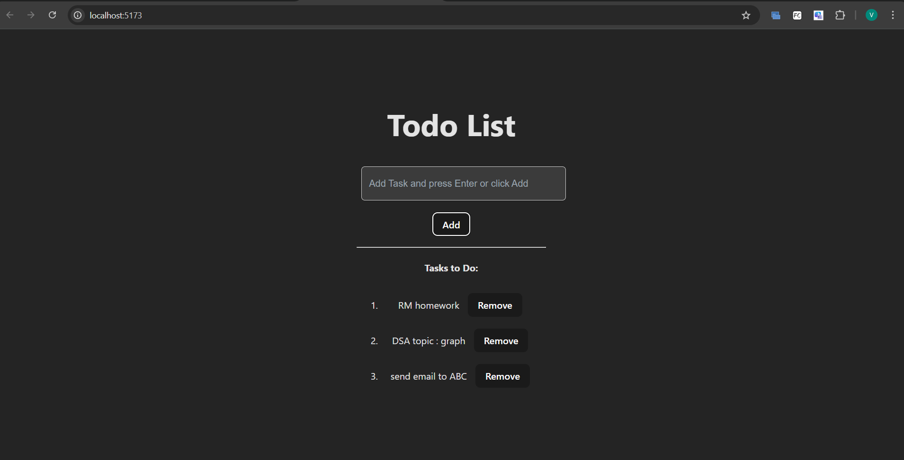

# 📝 Simple React Todo (Vite)

A minimal **React Todo App** built with **Vite**.  
It demonstrates basic React state handling — adding and removing todos — with clean and readable code.

<p align="center">
  
  
  
</p>

---

## 🖼️ Preview

<p align="center">
  
</p>

---

## 🚀 Features
- ➕ Add new todos (press **Enter** or click **Add**)
- ❌ Remove existing todos
- ⚡ Real-time updates (React state)
- ⌨️ Keyboard support
- 💡 Small, beginner-friendly codebase
- 🧠 In-memory storage (no backend)

---

## 🧰 Requirements
- **Node.js** 16+
- **npm** (comes with Node)
- **Git** (optional, for version control / GitHub upload)

---

## 🖥️ Installation & Running (Windows)
Open **VS Code Terminal** or **PowerShell**, then run:

```powershell
cd "c:\Users\vinee\Desktop\react\react-app2\my-app"
npm install
npm install uuid  # ensure UUID library is installed
npm run dev       # start development server

